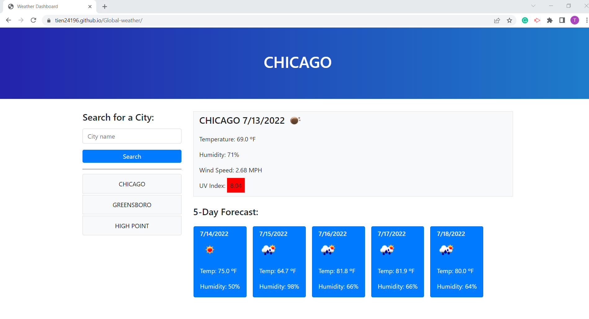

# Challenge VI

## Description
HTML, CSS and Javascript are used to create a weather application, where the user can submit a city and information about the city's current weather abd 5-day forecast will be displayed. All the weather information is collected from Openweather API.

## Screenshot

## Deployed Application

https://tien24196.github.io/Global-weather/